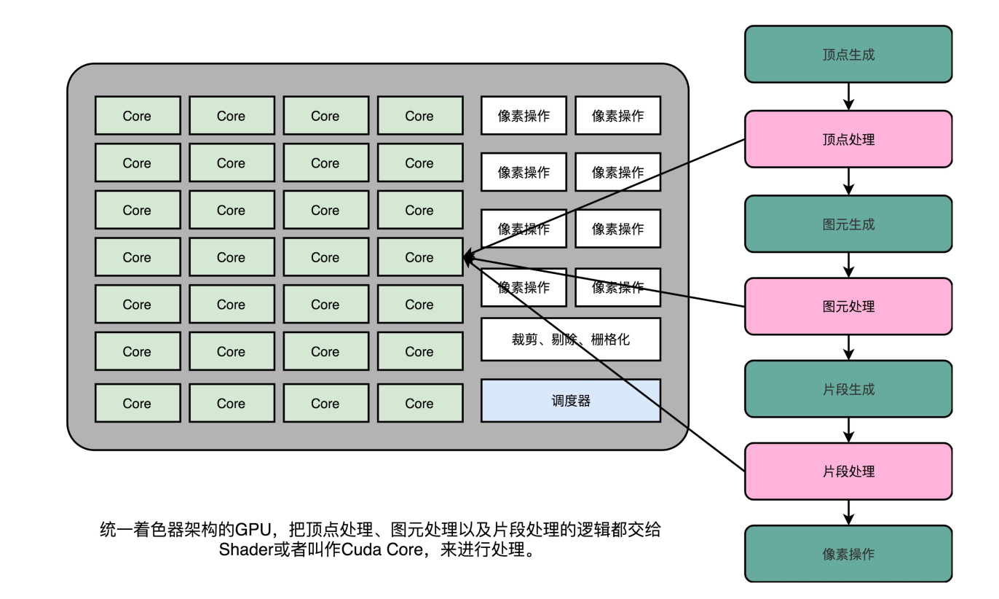

## 解放图形渲染的GPUCISC和RISC

在讲计算机指令的时候，给你看过MIPS体系结构计算机的机器指令格式。MIPS的指令都是固定的
32位长度，如果要用一个打孔卡来表示，并不复杂。


我带你编译了一些简单的C语言程序，看了x86体系结构下的汇编代码。眼尖的话，你应该能
发现，每一条机器码的长度是不一样的。


而CPU的指令集里的机器码是固定长度还是可变长度，也就是复杂指令集（Complex Instruction Set
Computing，简称CISC）和精简指令集（Reduced Instruction Set Computing，简称RISC）这两种风格的指令集一个最重要的差别。那今天我们就来看复杂指令集和精简指令集之间的对比、差异以及历史纠葛。

#### CISC VS RISC：历史的车轮不总是向前的

在计算机历史的早期，其实没有什么CISC和RISC之分。或者说，所有的CPU其实都是CISC。
虽然冯·诺依曼高屋建瓴地提出了存储程序型计算机的基础架构，但是实际的计算机设计和制造还是严格受
硬件层面的限制。当时的计算机很慢，存储空间也很小。《人月神话》这本软件工程界的名著，讲的是花了
好几年设计IBM 360这台计算机的经验。IBM 360的最低配置，每秒只能运行34500条指令，只有8K的内
存。为了让计算机能够做尽量多的工作，每一个字节乃至每一个比特都特别重要。所以，CPU指令集的设计，需要仔细考虑硬件限制。为了性能考虑，很多功能都直接通过硬件电路来完成。

为了少用内存，指令的长度也是可变的。就像算法和数据结构里的赫夫曼编码（Huffman coding）一样，
常用的指令要短一些，不常用的指令可以长一些。那个时候的计算机，想要用尽可能少的内存空间，存储尽
量多的指令。

不过，历史的车轮滚滚向前，计算机的性能越来越好，存储的空间也越来越大了。到了70年代末，RISC开
始登上了历史的舞台。当时，UC Berkeley的大卫·帕特森（David Patterson）教授发现，实际在CPU运行的
程序里，80%的时间都是在使用20%的简单指令。于是，他就提出了RISC的理念。自此之后，RISC类型的
CPU开始快速蓬勃发展。

我经常推荐的课后阅读材料，有不少是来自《计算机组成与设计：硬件/软件接口》和《计算机体系结构：
量化研究方法》这两本教科书。大卫·帕特森教授正是这两本书的作者。此外，他还在2017年获得了图灵
奖。


RISC架构的CPU究竟是什么样的呢？为什么它能在这么短的时间内受到如此大的追捧？

RISC架构的CPU的想法其实非常直观。既然我们80%的时间都在用20%的简单指令，那我们能不能只要那
20%的简单指令就好了呢？答案当然是可以的。因为指令数量多，计算机科学家们在软硬件两方面都受到了
很多挑战。

在硬件层面，我们要想支持更多的复杂指令，CPU里面的电路就要更复杂，设计起来也就更困难。更复杂的
电路，在散热和功耗层面，也会带来更大的挑战。在软件层面，支持更多的复杂指令，编译器的优化就变得
更困难。毕竟，面向2000个指令来优化编译器和面向500个指令来优化编译器的困难是完全不同的。
于是，在RISC架构里面，CPU选择把指令“精简”到20%的简单指令。而原先的复杂指令，则通过用简单指
令组合起来来实现，让软件来实现硬件的功能。这样，CPU的整个硬件设计就会变得更简单了，在硬件层面
提升性能也会变得更容易了。

RISC的CPU里完成指令的电路变得简单了，于是也就腾出了更多的空间。这个空间，常常被拿来放通用寄存器。因为RISC完成同样的功能，执行的指令数量要比CISC多，所以，如果需要反复从内存里面读取指令者数据到寄存器里来，那么很多时间就会花在访问内存上。于是，RISC架构的CPU往往就有更多的通用寄存器。

除了寄存器这样的存储空间，RISC的CPU也可以把更多的晶体管，用来实现更好的分支预测等相关功能，进一步去提升CPU实际的执行效率。

总的来说，对于CISC和RISC的对比，我们可以一起回到第4讲讲的程序运行时间的公式：

```
程序的CPU执行时间=指令数 × CPI × Clock Cycle Time
```

CISC的架构，其实就是通过优化指令数，来减少CPU的执行时间。而RISC的架构，其实是在优化CPI。因为指令比较简单，需要的时钟周期就比较少。

因为RISC降低了CPU硬件的设计和开发难度，所以从80年代开始，大部分新的CPU都开始采用RISC架构。从IBM的PowerPC，到SUN的SPARC，都是RISC架构。所有人看到仍然采用CISC架构的Intel CPU，都可以批评一句“Complex and messy”。但是，为什么无论是在PC上，还是服务器上，仍然是Intel成为最后的赢家呢？

#### Intel的进化：微指令架构的出现

面对这么多负面评价的Intel，自然也不能无动于衷。更何况，x86架构的问题并不能说明Intel的工程师不够
厉害。事实上，在整个CPU设计的领域，Intel集中了大量优秀的人才。无论是成功的Pentium时代引入的超
标量设计，还是失败的Pentium 4时代引入的超线程技术，都是异常精巧的工程实现。

而x86架构所面临的种种问题，其实都来自于一个最重要的考量，那就是指令集的向前兼容性。因为x86在
商业上太成功了，所以市场上有大量的Intel CPU。而围绕着这些CPU，又有大量的操作系统、编译器。这
些系统软件只支持x86的指令集，就比如著名的Windows 95。而在这些系统软件上，又有各种各样的应用软
件。

如果Intel要放弃x86的架构和指令集，开发一个RISC架构的CPU，面临的第一个问题就是所有这些软件都是
不兼容的。事实上，Intel并非没有尝试过在x86之外另起炉灶，这其实就是我在第26讲介绍的安腾处理器。
当时，Intel想要在CPU进入64位的时代的时候，丢掉x86的历史包袱，所以推出了全新的IA-64的架构。但
是，却因为不兼容x86的指令集，遭遇了重大的失败。

反而是AMD，趁着Intel研发安腾的时候，推出了兼容32位x86指令集的64位架构，也就是AMD64。如果你
现在在Linux下安装各种软件包，一定经常会看到像下面这样带有AMD64字样的内容。这是因为x86下的64
位的指令集x86-64，并不是Intel发明的，而是AMD发明的。

```
Get:1 http://archive.ubuntu.com/ubuntu bionic/main amd64 fontconfig amd64 2.12.6-0ubuntu2 [169 kB]
在Ubuntu下通过APT安装程序的时候，随处可见AMD64的关键字
```

花开两朵，各表一枝。Intel在开发安腾处理器的同时，也在不断借鉴其他RISC处理器的设计思想。既然核
心问题是要始终向前兼容x86的指令集，那么我们能不能不修改指令集，但是让CISC风格的指令集，用RISC的形式在CPU里面运行呢？

于是，从Pentium Pro时代开始，Intel就开始在处理器里引入了微指令（Micro-Instructions/Micro-Ops）架
构。而微指令架构的引入，也让CISC和RISC的分界变得模糊了。


在微指令架构的CPU里面，编译器编译出来的机器码和汇编代码并没有发生什么变化。但在指令译码的阶
段，指令译码器“翻译”出来的，不再是某一条CPU指令。译码器会把一条机器码，“翻译”成好几条“微
指令”。这里的一条条微指令，就不再是CISC风格的了，而是变成了固定长度的RISC风格的了。

这些RISC风格的微指令，会被放到一个微指令缓冲区里面，然后再从缓冲区里面，分发给到后面的超标量，并且是乱序执行的流水线架构里面。不过这个流水线架构里面接受的，就不是复杂的指令，而是精简的指令了。在这个架构里，我们的指令译码器相当于变成了设计模式里的一个“适配器”（Adaptor）。这个适配器，填平了CISC和RISC之间的指令差异。

不过，凡事有好处就有坏处。这样一个能够把CISC的指令译码成RISC指令的指令译码器，比原来的指令译
码器要复杂。这也就意味着更复杂的电路和更长的译码时间：本来以为可以通过RISC提升的性能，结果又有一部分浪费在了指令译码上。针对这个问题，我们有没有更好的办法呢？

我在前面说过，之所以大家认为RISC优于CISC，来自于一个数字统计，那就是在实际的程序运行过程中，
有80%运行的代码用着20%的常用指令。这意味着，CPU里执行的代码有很强的局部性。而对于有着很强局部性的问题，常见的一个解决方案就是使用缓存。

所以，Intel就在CPU里面加了一层L0 Cache。这个Cache保存的就是指令译码器把CISC的指令“翻译”成
RISC的微指令的结果。于是，在大部分情况下，CPU都可以从Cache里面拿到译码结果，而不需要让译码器去进行实际的译码操作。这样不仅优化了性能，因为译码器的晶体管开关动作变少了，还减少了功耗。
因为“微指令”架构的存在，从Pentium Pro开始，Intel处理器已经不是一个纯粹的CISC处理器了。它同样
融合了大量RISC类型的处理器设计。不过，由于Intel本身在CPU层面做的大量优化，比如乱序执行、分支预测等相关工作，x86的CPU始终在功耗上还是要远远超过RISC架构的ARM，所以最终在智能手机崛起替代PC的时代，落在了ARM后面。

#### ARM和RISC-V：CPU的现在与未来

2017年，ARM公司的CEO Simon Segards宣布，ARM累积销售的芯片数量超过了1000亿。作为一个从12个
人起步，在80年代想要获取Intel的80286架构授权来制造CPU的公司，ARM是如何在移动端把自己的芯片塑
造成了最终的霸主呢？

ARM这个名字现在的含义，是“Advanced RISC Machines”。你从名字就能够看出来，ARM的芯片是基于
RISC架构的。不过，ARM能够在移动端战胜Intel，并不是因为RISC架构。
到了21世纪的今天，CISC和RISC架构的分界已经没有那么明显了。Intel和AMD的CPU也都是采用译码成
RISC风格的微指令来运行。而ARM的芯片，一条指令同样需要多个时钟周期，有乱序执行和多发射。我甚
至看到过这样的评价，“ARM和RISC的关系，只有在名字上”。

ARM真正能够战胜Intel，我觉得主要是因为下面这两点原因。

第一点是功耗优先的设计。一个4核的Intel i7的CPU，设计的时候功率就是130W。而一块ARM A8的单个核
心的CPU，设计功率只有2W。两者之间差出了100倍。在移动设备上，功耗是一个远比性能更重要的指标，毕竟我们不能随时在身上带个发电机。ARM的CPU，主频更低，晶体管更少，高速缓存更小，乱序执行的能力更弱。所有这些，都是为了功耗所做的妥协。

第二点则是低价。ARM并没有自己垄断CPU的生产和制造，只是进行CPU设计，然后把对应的知识产权授权出去，让其他的厂商来生产ARM架构的CPU。它甚至还允许这些厂商可以基于ARM的架构和指令集，设计属于自己的CPU。像苹果、三星、华为，它们都是拿到了基于ARM体系架构设计和制造CPU的授权。ARM自己只是收取对应的专利授权费用。多个厂商之间的竞争，使得ARM的芯片在市场上价格很便宜。所以，尽管ARM的芯片的出货量远大于Intel，但是收入和利润却比不上Intel。

不过，ARM并不是开源的。所以，在ARM架构逐渐垄断移动端芯片市场的时候，“开源硬件”也慢慢发展
起来了。一方面，MIPS在2019年宣布开源；另一方面，从UC Berkeley发起的RISC-V项目也越来越受到大家的关注。而RISC概念的发明人，图灵奖的得主大卫·帕特森教授从伯克利退休之后，成了RISC-V国际开源实验室的负责人，开始推动RISC-V这个“CPU届的Linux”的开发。可以想见，未来的开源CPU，也多半会像
Linux一样，逐渐成为一个业界的主流选择。如果想要“打造一个属于自己CPU”，不可不关注这个项目。

## GPU

#### 为什么玩游戏需要使用GPU？

过去几年里，因为深度学习的大发展，GPU一下子火起来了，似乎GPU成了一个专为深度学习而设计的处理器。那GPU的架构究竟是怎么回事儿呢？它最早是用来做什么而被设计出来的呢？

想要理解GPU的设计，我们就要从GPU的老本行图形处理说起。因为图形处理才是GPU设计用来做的事情。只有了解了图形处理的流程，我们才能搞明白，为什么GPU要设计成现在这样；为什么在深度学习上，GPU比起CPU有那么大的优势。

#### GPU的历史进程

GPU是随着我们开始在计算机里面需要渲染三维图形的出现，而发展起来的设备。图形渲染和设备的先驱，
第一个要算是SGI（Silicon Graphics Inc.）这家公司。SGI的名字翻译成中文就是“硅谷图形公司”。这家
公司从80年代起就开发了很多基于Unix操作系统的工作站。它的创始人Jim Clark是斯坦福的教授，也是图
形学的专家。

后来，他也是网景公司（Netscape）的创始人之一。而Netscape，就是那个曾经和IE大战300回合的浏览器
公司，虽然最终败在微软的Windows免费捆绑IE的策略下，但是也留下了Firefox这个完全由开源基金会管理
的浏览器。不过这个都是后话了。

到了90年代中期，随着个人电脑的性能越来越好，PC游戏玩家们开始有了“3D显卡”的需求。那个时代之
前的3D游戏，其实都是伪3D。比如，大神卡马克开发的著名Wolfenstein 3D（德军总部3D），从不同视角
看到的是8幅不同的贴图，实际上并不是通过图形学绘制渲染出来的多边形。

这样的情况下，游戏玩家的视角旋转个10度，看到的画面并没有变化。但是如果转了45度，看到的画面就
变成了另外一幅图片。而如果我们能实时渲染基于多边形的3D画面的话，那么任何一点点的视角变化，都
会实时在画面里面体现出来，就好像你在真实世界里面看到的一样。

而在90年代中期，随着硬件和技术的进步，我们终于可以在PC上用硬件直接实时渲染多边形了。“真
3D”游戏开始登上历史舞台了。“古墓丽影”“最终幻想7”，这些游戏都是在那个时代诞生的。当时，很
多国内的计算机爱好者梦寐以求的，是一块Voodoo FX的显卡。

那为什么CPU的性能已经大幅度提升了，但是我们还需要单独的GPU呢？想要了解这个问题，我们先来看一看三维图像实际通过计算机渲染出来的流程。

#### 图形渲染的流程

现在我们电脑里面显示出来的3D的画面，其实是通过多边形组合出来的。你可以看看下面这张图，你在玩
的各种游戏，里面的人物的脸，并不是那个相机或者摄像头拍出来的，而是通过多边形建模（Polygon
Modeling）创建出来的。


而实际这些人物在画面里面的移动、动作，乃至根据光线发生的变化，都是通过计算机根据图形学的各种计
算，实时渲染出来的。

这个对于图像进行实时渲染的过程，可以被分解成下面这样5个步骤：

1. 顶点处理（Vertex Processing）
2. 图元处理（Primitive Processing）
3. 栅格化（Rasterization）
4. 片段处理（Fragment Processing）
5. 像素操作（Pixel Operations）

我们现在来一步一步看这5个步骤。

#### 顶点处理

图形渲染的第一步是顶点处理。构成多边形建模的每一个多边形呢，都有多个顶点（Vertex）。这些顶点都
有一个在三维空间里的坐标。但是我们的屏幕是二维的，所以在确定当前视角的时候，我们需要把这些顶点
在三维空间里面的位置，转化到屏幕这个二维空间里面。这个转换的操作，就被叫作顶点处理。

如果你稍微学过一点图形学的话，应该知道，这样的转化都是通过线性代数的计算来进行的。可以想见，我
们的建模约精细，需要转换的顶点数量就越多，计算量就越大。**而且，这里面每一个顶点位置的转换，互相**
**之间没有依赖，是可以并行独立计算的。**


#### 图元处理

在顶点处理完成之后呢，我们需要开始进行第二步，也就是图元处理。图元处理，其实就是要把顶点处理完
成之后的各个顶点连起来，变成多边形。其实转化后的顶点，仍然是在一个三维空间里，只是第三维的Z
轴，是正对屏幕的“深度”。所以我们针对这些多边形，需要做一个操作，叫剔除和裁剪（Cull and
Clip），也就是把不在屏幕里面，或者一部分不在屏幕里面的内容给去掉，减少接下来流程的工作量。


#### 栅格化

在图元处理完成之后呢，渲染还远远没有完成。我们的屏幕分辨率是有限的。它一般是通过一个个“像素
（Pixel）”来显示出内容的。所以，对于做完图元处理的多边形，我们要开始进行第三步操作。这个操作
就是把它们转换成屏幕里面的一个个像素点。这个操作呢，就叫作栅格化。这个栅格化操作，有一个特点和
上面的顶点处理是一样的，就是每一个图元都可以并行独立地栅格化。


#### 片段处理

在栅格化变成了像素点之后，我们的图还是“黑白”的。我们还需要计算每一个像素的颜色、透明度等信
息，给像素点上色。这步操作，就是片段处理。**这步操作，同样也可以每个片段并行、独立进行，和上面的**
**顶点处理和栅格化一样**


#### 像素操作

最后一步呢，我们就要把不同的多边形的像素点“混合（Blending）”到一起。可能前面的多边形可能是半
透明的，那么前后的颜色就要混合在一起变成一个新的颜色；或者前面的多边形遮挡住了后面的多边形，那
么我们只要显示前面多边形的颜色就好了。最终，输出到显示设备。


经过这完整的5个步骤之后，我们就完成了从三维空间里的数据的渲染，变成屏幕上你可以看到的3D动画
了。这样5个步骤的渲染流程呢，一般也被称之为**图形流水线**（Graphic Pipeline）。这个名字和我们讲解
CPU里面的流水线非常相似，都叫**Pipeline**。


### 解放图形渲染的GPU

我们可以想一想，如果用CPU来进行这个渲染过程，需要花上多少资源呢？我们可以通过一些数据来做个粗
略的估算。

在上世纪90年代的时候，屏幕的分辨率还没有现在那么高。一般的CRT显示器也就是640×480的分辨率。这
意味着屏幕上有30万个像素需要渲染。为了让我们的眼睛看到画面不晕眩，我们希望画面能有60帧。于
是，每秒我们就要重新渲染60次这个画面。也就是说，每秒我们需要完成1800万次单个像素的渲染。从栅
格化开始，每个像素有3个流水线步骤，即使每次步骤只有1个指令，那我们也需要5400万条指令，也就是
54M条指令。

90年代的CPU的性能是多少呢？93年出货的第一代Pentium处理器，主频是60MHz，后续逐步推出了
66MHz、75MHz、100MHz的处理器。以这个性能来看，用CPU来渲染3D图形，基本上就要把CPU的性能用完了。因为实际的每一个渲染步骤可能不止一个指令，我们的CPU可能根本就跑不动这样的三维图形渲染。

也就是在这个时候，Voodoo FX这样的图形加速卡登上了历史舞台。既然图形渲染的流程是固定的，那我们
直接用硬件来处理这部分过程，不用CPU来计算是不是就好了？很显然，这样的硬件会比制造有同样计算性
能的CPU要便宜得多。因为整个计算流程是完全固定的，不需要流水线停顿、乱序执行等等的各类导致CPU
计算变得复杂的问题。我们也不需要有什么可编程能力，只要让硬件按照写好的逻辑进行运算就好了。

那个时候，整个顶点处理的过程还是都由CPU进行的，不过后续所有到图元和像素级别的处理都是通过
Voodoo FX或者TNT这样的显卡去处理的。也就是从这个时代开始，我们能玩上“真3D”的游戏了。


不过，无论是Voodoo FX还是NVidia TNT。整个显卡的架构还不同于我们现代的显卡，也没有现代显卡去进行各种加速深度学习的能力。这个能力，要到NVidia提出Unified Shader Archicture才开始具备。这也是我
们下一讲要讲的内容。

#### Shader的诞生和可编程图形处理器

不知道你有没有发现，在Voodoo和TNT显卡的渲染管线里面，没有“顶点处理“这个步骤。在当时，把多
边形的顶点进行线性变化，转化到我们的屏幕的坐标系的工作还是由CPU完成的。所以，CPU的性能越好，
能够支持的多边形也就越多，对应的多边形建模的效果自然也就越像真人。而3D游戏的多边形性能也受限
于我们CPU的性能。无论你的显卡有多快，如果CPU不行，3D画面一样还是不行。

所以，1999年NVidia推出的GeForce 256显卡，就把顶点处理的计算能力，也从CPU里挪到了显卡里。不
过，这对于想要做好3D游戏的程序员们还不够，即使到了GeForce 256。整个图形渲染过程都是在硬件里面
固定的管线来完成的。程序员们在加速卡上能做的事情呢，只有改配置来实现不同的图形渲染效果。如果通
过改配置做不到，我们就没有什么办法了。

这个时候，程序员希望我们的GPU也能有一定的可编程能力。这个编程能力不是像CPU那样，有非常通用的指令，可以进行任何你希望的操作，而是在整个的渲染管线（Graphics Pipeline）的一些特别步骤，能够自己去定义处理数据的算法或者操作。于是，从2001年的Direct3D 8.0开始，微软第一次引入了可编程管线
（Programable Function Pipeline）的概念。


一开始的可编程管线呢，仅限于顶点处理（Vertex Processing）和片段处理（Fragment Processing）部
分。比起原来只能通过显卡和Direct3D这样的图形接口提供的固定配置，程序员们终于也可以开始在图形效
果上开始大显身手了。

这些可以编程的接口，我们称之为Shader，中文名称就是着色器。之所以叫“着色器”，是因为一开始这
些“可编程”的接口，只能修改顶点处理和片段处理部分的程序逻辑。我们用这些接口来做的，也主要是光
照、亮度、颜色等等的处理，所以叫着色器。

这个时候的GPU，有两类Shader，也就是Vertex Shader和Fragment Shader。我们在上一讲看到，在进行
顶点处理的时候，我们操作的是多边形的顶点；在片段操作的时候，我们操作的是屏幕上的像素点。对于顶
点的操作，通常比片段要复杂一些。所以一开始，这两类Shader都是独立的硬件电路，也各自有独立的编
程接口。因为这么做，硬件设计起来更加简单，一块GPU上也能容纳下更多的Shader。

不过呢，大家很快发现，虽然我们在顶点处理和片段处理上的具体逻辑不太一样，但是里面用到的指令集可
以用同一套。而且，虽然把Vertex Shader和Fragment Shader分开，可以减少硬件设计的复杂程度，但是也
带来了一种浪费，有一半Shader始终没有被使用。在整个渲染管线里，Vertext Shader运行的时候，
Fragment Shader停在那里什么也没干。Fragment Shader在运行的时候，Vertext Shader也停在那里发呆。
本来GPU就不便宜，结果设计的电路有一半时间是闲着的。喜欢精打细算抠出每一分性能的硬件工程师当然
受不了了。于是，统一着色器架构（Unified Shader Architecture）就应运而生了。

既然大家用的指令集是一样的，那不如就在GPU里面放很多个一样的Shader硬件电路，然后通过统一调
度，把顶点处理、图元处理、片段处理这些任务，都交给这些Shader去处理，让整个GPU尽可能地忙起来。这样的设计，就是我们现代GPU的设计，就是统一着色器架构。

有意思的是，这样的GPU并不是先在PC里面出现的，而是来自于一台游戏机，就是微软的XBox 360。后
来，这个架构才被用到ATI和NVidia的显卡里。这个时候的“着色器”的作用，其实已经和它的名字关系不
大了，而是变成了一个通用的抽象计算模块的名字。

正是因为Shader变成一个“通用”的模块，才有了把GPU拿来做各种通用计算的用法，也就
是GPGPU（General-Purpose Computing on Graphics Processing Units，通用图形处理器）。而正是因为
GPU可以拿来做各种通用的计算，才有了过去10年深度学习的火热。



#### 芯片瘦身

我们先来回顾一下，之前花了很多讲仔细讲解的现代CPU。现代CPU里的晶体管变得越来越多，越来越复
杂，其实已经不是用来实现“计算”这个核心功能，而是拿来实现处理乱序执行、进行分支预测，以及我们
之后要在存储器讲的高速缓存部分。

而在GPU里，这些电路就显得有点多余了，GPU的整个处理过程是一个流式处理（Stream Processing）的
过程。因为没有那么多分支条件，或者复杂的依赖关系，我们可以把GPU里这些对应的电路都可以去掉，做
一次小小的瘦身，只留下取指令、指令译码、ALU以及执行这些计算需要的寄存器和缓存就好了。一般来
说，我们会把这些电路抽象成三个部分，就是下面图里的取指令和指令译码、ALU和执行上下文。


#### 多核并行和SIMT

这样一来，我们的GPU电路就比CPU简单很多了。于是，我们就可以在一个GPU里面，塞很多个这样并行的GPU电路来实现计算，就好像CPU里面的多核CPU一样。和CPU不同的是，我们不需要单独去实现什么多线程的计算。因为GPU的运算是天然并行的。


我们在上一讲里面其实已经看到，无论是对多边形里的顶点进行处理，还是屏幕里面的每一个像素进行处
理，每个点的计算都是独立的。所以，简单地添加多核的GPU，就能做到并行加速。不过光这样加速还是不
够，工程师们觉得，性能还有进一步被压榨的空间。

CPU里有一种叫作SIMD的处理技术。这个技术是说，在做向量计算的时候，我们
要执行的指令是一样的，只是同一个指令的数据有所不同而已。在GPU的渲染管线里，这个技术可就大有用
处了。

无论是顶点去进行线性变换，还是屏幕上临近像素点的光照和上色，都是在用相同的指令流程进行计算。所
以，GPU就借鉴了CPU里面的SIMD，用了一种叫作SIMT（Single Instruction，Multiple Threads）的技术。SIMT呢，比SIMD更加灵活。在SIMD里面，CPU一次性取出了固定长度的多个数据，放到寄存器里面，用一个指令去执行。而SIMT，可以把多条数据，交给不同的线程去处理。

各个线程里面执行的指令流程是一样的，但是可能根据数据的不同，走到不同的条件分支。这样，相同的代
码和相同的流程，可能执行不同的具体的指令。这个线程走到的是if的条件分支，另外一个线程走到的就是
else的条件分支了。


#### GPU里的“超线程

虽然GPU里面的主要以数值计算为主。不过既然已经是一个“通用计算”的架构了，GPU里面也避免不了会
有if…else这样的条件分支。但是，在GPU里我们可没有CPU这样的分支预测的电路。这些电路在上面“芯
片瘦身”的时候，就已经被我们砍掉了。

所以，GPU里的指令，可能会遇到和CPU类似的“流水线停顿”问题。想到流水线停顿，你应该就能记起，
我们之前在CPU里面讲过超线程技术。在GPU上，我们一样可以做类似的事情，也就是遇到停顿的时候，调度一些别的计算任务给当前的ALU。

和超线程一样，既然要调度一个不同的任务过来，我们就需要针对这个任务，提供更多的执行上下文。所
以，一个Core里面的执行上下文的数量，需要比ALU多。


#### GPU在深度学习上的性能差异

在通过芯片瘦身、SIMT以及更多的执行上下文，我们就有了一个更擅长并行进行暴力运算的GPU。这样的
芯片，也正适合我们今天的深度学习的使用场景。

一方面，GPU是一个可以进行“通用计算”的框架，我们可以通过编程，在GPU上实现不同的算法。另一方
面，现在的深度学习计算，都是超大的向量和矩阵，海量的训练样本的计算。整个计算过程中，没有复杂的
逻辑和分支，非常适合GPU这样并行、计算能力强的架构。

我们去看NVidia 2080显卡的技术规格，就可以算出，它到底有多大的计算能力。
2080一共有46个SM（Streaming Multiprocessor，流式处理器），这个SM相当于GPU里面的GPU Core，所以你可以认为这是一个46核的GPU，有46个取指令指令译码的渲染管线。每个SM里面有64个Cuda Core。你可以认为，这里的Cuda Core就是我们上面说的ALU的数量或者Pixel Shader的数量，46x64呢一共就有2944个Shader。然后，还有184个TMU，TMU就是Texture Mapping Unit，也就是用来做纹理映射的计算单元，它也可以认为是另一种类型的Shader。


```
2080 Super显卡有48个SM，比普通版的2080多2个。每个SM（SM也就是GPU Core）里有64个Cuda
Core，也就是Shader
```

2080 Super显卡有48个SM，比普通版的2080多2个。每个SM（SM也就是GPU Core）里有64个Cuda
Core，也就是Shader：

```
（2944 + 184）× 1700 MHz × 2 = 10.06 TFLOPS
```

对照一下官方的技术规格，正好就是10.07TFLOPS。
那么，最新的Intel i9 9900K的性能是多少呢？不到1TFLOPS。而2080显卡和9900K的价格却是差不多的。所以，在实际进行深度学习的过程中，用GPU所花费的时间，往往能减少一到两个数量级。而大型的深度学习模型计算，往往又是多卡并行，要花上几天乃至几个月。这个时候，用CPU显然就不合适了。今天，随着GPGPU的推出，GPU已经不只是一个图形计算设备，更是一个用来做数值计算的好工具了。同
样，也是因为GPU的快速发展，带来了过去10年深度学习的繁荣。

## FPGA

FPGA，也就是现场可编程门阵列（Field-Programmable Gate Array）。

* P代表Programmable，这个很容易理解。也就是说这是一个可以通过编程来控制的硬件

-   G代表Gate也很容易理解，它就代表芯片里面的门电路。我们能够去进行编程组合的就是这样一个一个门电路。
-   A代表的Array，叫作阵列，说的是在一块FPGA上，密密麻麻列了大量Gate这样的门电路。
-   最后一个F，不太容易理解。它其实是说，一块FPGA这样的板子，可以进行在“现场”多次地进行编程。
    它不像PAL（Programmable Array Logic，可编程阵列逻辑）这样更古老的硬件设备，只能“编程”一
    次，把预先写好的程序一次性烧录到硬件里面，之后就不能再修改了。

这么看来，其实“FPGA”这样的组合，基本上解决了我们前面说的想要设计硬件的问题。我们可以像软件
一样对硬件编程，可以反复烧录，还有海量的门电路，可以组合实现复杂的芯片功能。

不过，相信你和我一样好奇，我们究竟怎么对硬件进行编程呢？我们之前说过，CPU其实就是通过晶体管，
来实现各种组合逻辑或者时序逻辑。那么，我们怎么去“编程”连接这些线路呢？

FPGA的解决方案很精巧，我把它总结为这样三个步骤。

第一，用存储换功能实现组合逻辑。在实现CPU的功能的时候，我们需要完成各种各样的电路逻辑。在
FPGA里，这些基本的电路逻辑，不是采用布线连接的方式进行的，而是预先根据我们在软件里面设计的逻
辑电路，算出对应的真值表，然后直接存到一个叫作LUT（Look-Up Table，查找表）的电路里面。这个LUT呢，其实就是一块存储空间，里面存储了“特定的输入信号下，对应输出0还是1”。


如果还没理解，你可以想一下这个问题。假如现在我们要实现一个函数，这个函数需要返回斐波那契数列的
第N项，并且限制这个N不会超过100。该怎么解决这个问题呢？

斐波那契数列的通项公式是 f(N) = f(N-1) + f(N-2) 。所以，我们的第一种办法，自然是写一个程序，从第1项
开始算。但其实还有一种办法，就是我们预先用程序算好斐波那契数量前100项，然后把它预先放到一个数
组里面。这个数组就像 [1, 1, 2, 3, 5…] 这样。当要计算第N项的时候呢，我们并不是去计算得到结果，而是
直接查找这个数组里面的第N项。


## ASIC

## TPU

## 虚拟机

