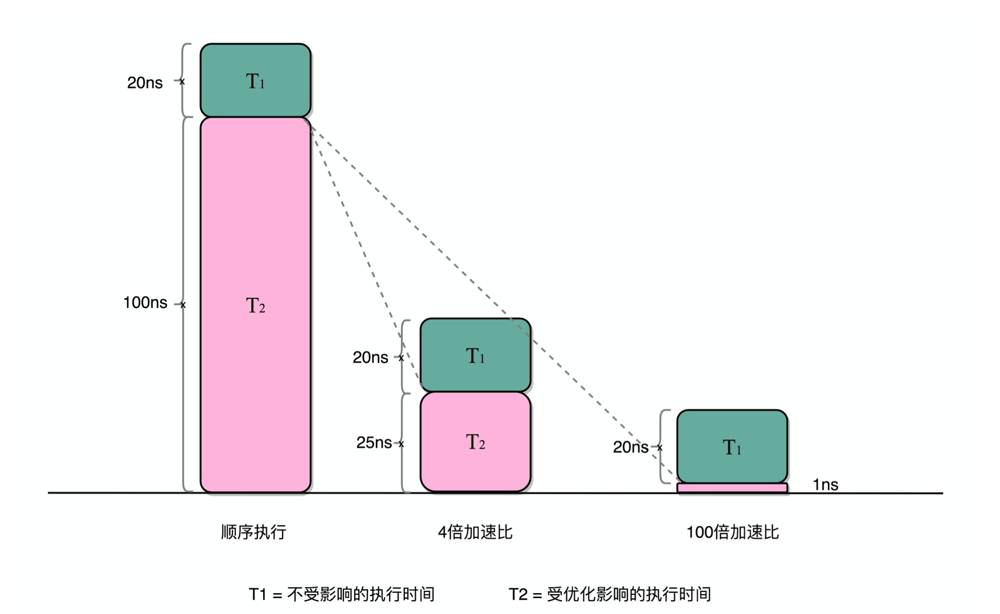

# 计算机功耗

根据公式：

```
程序的CPU执行时间 = 指令数×CPI×Clock Cycle Time
```

如果要提升计算机的性能，我们可以从指令数、CPI以及CPU主频这三个地方入手。要搞定指令 数或者CPI，乍一看都不太容易。于是，研发CPU的硬件工程师们，从80年代开始，就挑上了CPU这个“软柿子”。在CPU上多放一点晶体管，不断提升CPU的时钟频率，这样就能让CPU变得更快，程序的执行时间就会缩短。

于是，从1978年Intel发布的8086 CPU开始，计算机的主频从5MHz开始，不断提升。1980年代中期的 80386能够跑到40MHz，1989年的486能够跑到100MHz，直到2000年的奔腾4处理器，主频已经到达了 1.4GHz。而消费者也在这20年里养成了“看主频”买电脑的习惯。当时已经基本垄断了桌面CPU市场的 Intel更是夸下了海口，表示奔腾4所使用的CPU结构可以做到10GHz，颇有一点“大力出奇迹”的意思。


## 功耗

然而，计算机科学界从来不相信“大力出奇迹”。奔腾4的CPU主频从来没有达到过10GHz，最终它的主频 上限定格在3.8GHz。这还不是最糟的，更糟糕的事情是，大家发现，奔腾4的主频虽然高，但是它的实际性 能却配不上同样的主频。想要用在笔记本上的奔腾4 2.4GHz处理器，其性能只和基于奔腾3架构的奔腾M 1.6GHz处理器差不多。

于是，这一次的“大力出悲剧”，不仅让Intel的对手AMD获得了喘息之机，更是代表着“主频时代”的终 结。后面几代Intel CPU主频不但没有上升，反而下降了。到如今，2019年的最高配置Intel i9 CPU，主频也 只不过是5GHz而已。相较于1978年到2000年，这20年里300倍的主频提升，从2000年到现在的这19年， CPU的主频大概提高了3倍。

奔腾4的主频为什么没能超过3.8GHz的障碍呢?答案就是功耗问题。什么是功耗问题呢?我们先看一个直观 的例子。

一个3.8GHz的奔腾4处理器，满载功率是130瓦。这个130瓦是什么概念呢?机场允许带上飞机的充电宝的容 量上限是100瓦时。如果我们把这个CPU安在手机里面，不考虑屏幕内存之类的耗电，这个CPU满载运行45 分钟，充电宝里面就没电了。而iPhone X使用ARM架构的CPU，功率则只有4.5瓦左右。

我们的CPU，一般都被叫作超大规模集成电路(Very-Large-Scale Integration，VLSI)。这些电路，实际上 都是一个个晶体管组合而成的。CPU在计算，其实就是让晶体管里面的“开关”不断地去“打开”和“关 闭”，来组合完成各种运算和功能。

想要计算得快，一方面，我们要在CPU里，同样的面积里面，多放一些晶体管，也就是增加密度;另一方 面，我们要让晶体管“打开”和“关闭”得更快一点，也就是提升主频。而这两者，都会增加功耗，带来耗 电和散热的问题。

这么说可能还是有点抽象，我还是给你举一个例子。你可以把一个计算机CPU想象成一个巨大的工厂，里面 有很多工人，相当于CPU上面的晶体管，互相之间协同工作。

为了工作得快一点，我们要在工厂里多塞一点人。你可能会问，为什么不把工厂造得大一点呢?这是因为， 人和人之间如果离得远了，互相之间走过去需要花的时间就会变长，这也会导致性下降。这就好像如果CPU 的面积大，晶体管之间的距离变大，电信号传输的时间就会变长，运算速度自然就慢了。

除了多塞一点人，我们还希望每个人的动作都快一点，这样同样的时间里就可以多干一点活儿了。这就相当 于提升CPU主频，但是动作快，每个人就要出汗散热。要是太热了，对工厂里面的人来说会中暑生病，对 CPU来说就会崩溃出错。

我们会在CPU上面抹硅脂、装风扇，乃至用上水冷或者其他更好的散热设备，就好像在工厂里面装风扇、空 调，发冷饮一样。但是同样的空间下，装上风扇空调能够带来的散热效果也是有极限的。

因此，在CPU里面，能够放下的晶体管数量和晶体管的“开关”频率也都是有限的。一个CPU的功率，可以 用这样一个公式来表示:

```
功耗 ~= 1/2 ×负载电容×电压的平方×开关频率×晶体管数量
```

那么，为了要提升性能，我们需要不断地增加晶体管数量。同样的面积下，我们想要多放一点晶体管，就要 把晶体管造得小一点。这个就是平时我们所说的提升“制程”。从28nm到7nm，相当于晶体管本身变成了 原来的1/4大小。这个就相当于我们在工厂里，同样的活儿，我们要找瘦小一点的工人，这样一个工厂里面 就可以多一些人。我们还要提升主频，让开关的频率变快，也就是要找手脚更快的工人。

但是，功耗增加太多，就会导致CPU散热跟不上，这时，我们就需要降低电压。这里有一点非常关键，在整 个功耗的公式里面，功耗和电压的平方是成正比的。这意味着电压下降到原来的1/5，整个的功耗会变成原 来的1/25。

事实上，从5MHz主频的8086到5GHz主频的Intel i9，CPU的电压已经从5V左右下降到了1V左右。这也是为 什么我们CPU的主频提升了1000倍，但是功耗只增长了40倍。比如说，我写这篇文章用的是Surface Go， 在这样的轻薄笔记本上，微软就是选择了把电压下降到0.25V的低电压CPU，使得笔记本能有更长的续航时 间。

## 并行优化，理解阿姆达尔定律

对于一个程序进行优化之后，处理器并行运算之后效率提升的情况。具体可以用这样一个公式 来表示:

```
优化后的执行时间 = 受优化影响的执行时间/加速倍数+不受影响的执行时间
```



## 总结

我们可以看到，无论是简单地通过提升主频，还是增加更多的CPU核心数量，通过并行来提升性能，都会遇 到相应的瓶颈。仅仅简单地通过“堆硬件”的方式，在今天已经不能很好地满足我们对于程序性能的期望 了。于是，工程师们需要从其他方面开始下功夫了。

在“摩尔定律”和“并行计算”之外，在整个计算机组成层面，还有这样几个原则性的性能提升方法。

1. 加速大概率事件。最典型的就是，过去几年流行的深度学习，整个计算过程中，99%都是向量和矩阵计 算，于是，工程师们通过用GPU替代CPU，大幅度提升了深度学习的模型训练过程。本来一个CPU需要跑几 小时甚至几天的程序，GPU只需要几分钟就好了。Google更是不满足于GPU的性能，进一步地推出了TPU。 后面的文章，我也会为你讲解GPU和TPU的基本构造和原理。

2. 通过流水线提高性能。现代的工厂里的生产线叫“流水线”。我们可以把装配iPhone这样的任务拆分成一 个个细分的任务，让每个人都只需要处理一道工序，最大化整个工厂的生产效率。类似的，我们的CPU其实 就是一个“运算工厂”。我们把CPU指令执行的过程进行拆分，细化运行，也是现代CPU在主频没有办法提 升那么多的情况下，性能仍然可以得到提升的重要原因之一。我们在后面也会讲到，现代CPU里是如何通过 流水线来提升性能的，以及反面的，过长的流水线会带来什么新的功耗和效率上的负面影响。

3. 通过预测提高性能。通过预先猜测下一步该干什么，而不是等上一步运行的结果，提前进行运算，也是让 程序跑得更快一点的办法。典型的例子就是在一个循环访问数组的时候，凭经验，你也会猜到下一步我们会 访问数组的下一项。后面要讲的“分支和冒险”、“局部性原理”这些CPU和存储系统设计方法，其实都是 在利用我们对于未来的“预测”，提前进行相应的操作，来提升我们的程序性能。